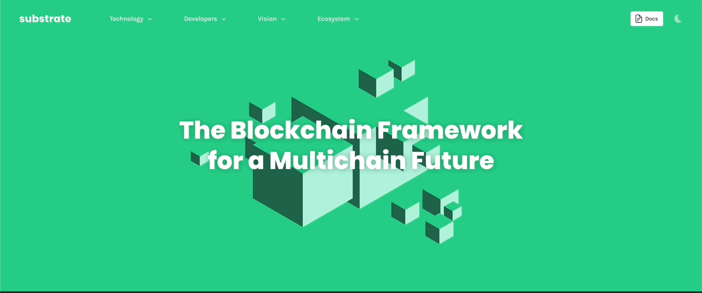

# Hello Substrate!

---

## What is Substrate?

Substrate is a **Rust framework** for **building blockchains** in a modular and extensible way.

---v

### Why Substrate?

Notes:
Highlight the multi-chain part.

---v

### Why Substrate?

Polkadot is the biggest bet in this ecosystem against chain maximalism, and Substrate plays a big
role in this scenario.

---v

### Why Substrate?

- ⛓️ Future is multi-chain ⛓️.
- Building a blockchain is hard and prone to mistakes.
<!-- .element: class="fragment" -->
- The need for a framework to build various blockchains is crucial for this future.
<!-- .element: class="fragment" -->

---v

### Building blockchains

Without subtrate:

- Writing blockchains is hard.
- Coordination of upgrades in blockchains is hard.
- We are going to spend maximal resources at making sure we get it right.
<!-- .element: class="fragment" -->

---v

### Building blockchains

Thinking the substrate way:

- **society and technology will evolve**.
- _It is only a matter of time until the "right choice" of today turns into a mistake in the future._

---v

### Substrate pillars

These ideas are reflected in:

- Rust as a language.
- Generic. Very generic.
- Upgradeability. Cover your needs as you evolve.

Notes:
Think about how each of these links back to "whatever you decide today will be a mistake soon".

---v

### Substrate pillars: Rust

- Memory safety is a fundamental issue in most major system-level programming languages.
- 😇 You **cannot** make certain mistakes in Rust.
- Most Rust abtractions are **zero-cost**. Is as fast as a binary can be.

Notes:
this is not 100% accurate though, rust has a small runtime that is the panic handler etc. Rust for
Rustacean's chapter on no_std covers this very well.

---v

### Substrate pillars: Generic

Let's you make your own choices

- Multiple consensus engines (BABE/Grandpa/AURA)
- Multiple network protocols (QUIC, TCP)
- Multiple database implementations (ParityDB, RocksDB)
- Multiple ledger-state formats (UTXO, Account-based)

---v

### Substrate pillars: Generic

Implementations in multiple flavors.

- **AlephZero**: Custom consensus, DAG-based, 1s block time.
- **Moonbeam**: Ethereum compatible.
- **HydraDX**: Custom transaction pool logic to match DEX orders.
- **Kulupu**: Proof of work, custom hashing.

Notes:
Substrate has been coded, from the ground up, such that it is easy to have multiple implementations
for certain functions. Heavy use of traits and generics is the key to achieve this. As noted,
Substrate has a lot of APIs, and optional implementations. You are bound to the API, but not the
particular implementation.

---v

### Substrate pillars: Upgradeability

- 🔝 Substrate is HIGHLY upgradable.
- 🚀 Encoding the **application logic** of the chain as Wasm, and storing it onchain, such that it can be upgraded on the fly.

Notes:
make a good pause here and let them digest this.

---

### Substrate Architecture

---

## The runtime

- The runtime contains all of the **business logic** of the chain.

<!-- .element: class="fragment" -->

- The runtime is the **state transition function**.

<!-- .element: class="fragment" -->

- The runtime is the definition of **how your blockchain executes blocks**.

<!-- .element: class="fragment" -->

Notes:

- Among the definitions of the Wasm runtime, let's recap what the state transition is.
- The block execution definition will be described more in the Wasm-meta lecture.

---v

### State transition

> (Wasm) Runtime ~ STF ~ Application/Business Logic

- **State:** The information on which consensus will be agreed upon.
- **Transition:** The runtime will define how this state changes.

---v

### State Transition

---v

### Using Wasm because of...

- Deterministic execution
- Sandboxing
- Easier client development, including light clients.
- Forkless upgrades!

Notes:
- The need for determinism in a blockchain runtime is _absolute_.
- Substrate uses the same Wasm machinery for executing:
	1. Smart contracts
	1. Parachain runtime (i.e. PVF)
- A Substrate client written in a different language needs to ONLY implement the host/client side.
- Then, possibly ALL SUBSTRATE BASED CHAINS will get a new client.
---v

### Not everything could be good

- Limited resources (memory, speed).
- 4GB of memory, which we limit even further in the substrate allocator.
- Can be slower than native, depending on the executor.

---v

### What should I use to write my Wasm Runtime?

- Any language that can compile to Wasm and exposes a fixed set of functions, to be used by the client.
- ... But, of course, Substrate comes with a framework to make this developer-friendly, **FRAME™️**.

---

## The client, the node

- Everything else you need in a blockchain, except the runtime.
- Compiled to native.
- Less need for determinism.
- Is a regular binary!

Notes:

- Has access to anything a normal native binary does (memory, disk, syscalls etc.)
- Does all the other shared things that most blockchains want
  - Database, Networking, Mempool, Consensus..

---v

### What can we find in the client ?

Notes:
Walk over each component and explain what role they play. Nomenclature stuff.

---v

### Database

- The client is in charge of storing the data, but has **no meaningful way to interpret it**.

	1. Client view: `0x1234...` => `0x6543...`
	1. Runtime view: `my_balance` => `100`

- The database, from the client's PoV, is a _untyped_, _opaque_, key-value storage. While the runtime knows which key means what.

> Exceptions like `:code` exists, the key for the Wasm blob, and is part of what we know as well known keys.

---v

### Consensus

- Yes, consensus is not a core part of a blockchain runtime.
  It is not application logic.
  It is not something you want to customize.

- The consensus protocol is to your runtime what HTTP is to Facebook.

Notes:

The runtime is the application you want to run.
Consensus is outside of this application helping us agree what the official state of this runtime is.

Imagine a writers room for some TV show.
Writers are sitting around coming up with potential plot points for future episodes.
Any of their ideas could work.
But eventually they need to agree what the next episode to air actually will be.

---

## Client and runtime need to communicate

Runtime --> client via **Host Functions**. SCALE encoded information.

Client --> Runtime via **Runtime APIs**.

Notes:

- SCALE is an efficient, non-descriptive, binary encoding format, used EXTENSIVELY in the Substrate ecosystem.

---

### Videogame console analogy

<hs-cols>
<hs-col>

Substrate Client

</hs-col>
<hs-col>

Substrate Runtime

</hs-col>
</hs-cols>