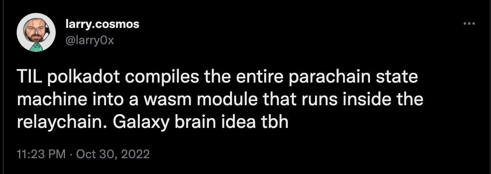

# Substrate Host functions & Runtime APIs
---

## Remember

- One big decision in Substrate is the client / runtime separation.
  - Which is a fixed opinion.
  - But enables countless other things to **not be fixed**.

Notes:

Recall that the boundary for this division is the **state transition**.
Anything dictating how your state transitions is the runtime.
It is only a matter of time until every blockchain is doing the same thing.

---v

## Blockchain space is aware of this



---

## A quick double click


---v

### A quick double click

Node and the runtime can communicate with each other:
- **Host Functions**: Means of a runtime communicating with its host environment, i.e. the Substrate client.
- **Runtime API**: The well-defined functions that a Wasm substrate runtime is providing.
- Communication language of client/runtime is SCALE
- The DB is a _untyped_, _opaque_, **key-value** storage, on the **client side**.

Notes:

```rust
let bytes: Vec<u8> = 42u128.encode();
let typed: u128 = vec![1, 2, 3, 4, 5, 6, 7, 8].decode();
```

---

## Let's apply what we have learnt

---

## Mutating state


---v

### Mutating state

```rust [1-100|1-2|4,5|7,8|10,11|13,14|16,17|1-100]
// the runtime decides what key stores alice's balance.
key: Vec<u8> = b"alice_balance".to_vec();

// the runtime reads the raw bytes form that key.
let current_alice_balance_raw: Vec<u8> = host_functions::get(key);

// and needs to know to which type it should be decoded, u128.
let mut current_alice_balance: u128 = current_alice_balance_raw.decode();

// actual logic.
current_alice_balance += 100;

// encode this again into an opaque byte-array.
let new_balance_encoded: Vec<u8> = current_alice_balance.encode();

// write the encoded bytes again.
host_functions::set(key, new_balance_encoded);
```

---v

### Mutating state

What's our take from the previos example ?

The runtime needs host functions to read/write to state.
<!-- .element: class="fragment" -->
```rust
/// a hypothetical set of host functions.
trait HostFunctions {
  fn get(key: Vec<u8>) -> Vec<u8>;
  fn set(key: Vec<u8>, value: Vec<u8>);
}
```
<!-- .element: class="fragment" -->
Could the client do this without a runtime ?
<!-- .element: class="fragment" -->

Notes:

- The client does not know where my balance is.
- It does not know which types it has.
[`well_known_keys`](https://paritytech.github.io/substrate/master/sp_storage/well_known_keys/index.html)
- Double click in the difference in view between the client and the runtime

---

## Block import

Notes:

In this scenario there are functions in both sides, client and runtime

---v

### Block import

- Once again:
The client just sees opaque bytes.

<div>

- So that the runtime can change its storage layout/definition in a forkless manner!
- State layout is by definition part of the state transition function.

</div>
<!-- .element: class="fragment" -->

---v

### Block import

- So, are extrinsics part of the state transition function too ?

- YEES! we want the runtime to be able to change its extrinsic format!
<!-- .element: class="fragment" -->

Notes:
do we want to able to update our extrinsic format as well in a forkless manner?

---v

### Block import

```rust [1-100|1-2|4-6|8-9|1-100]
// fetch the block from the outer world.
let opaque_block: Vec<u8> = networking::import_queue::next_block();

// initialize a wasm runtime.
let code = database::get(well_known_keys::CODE);
let runtime = wasm::Executor::new(code);

// call into this runtime.
runtime.execute_block(opaque_block);
```

---v

### Block import

- The client needs a runtime API for asking the runtime to execute the block.

```rust
trait RuntimeApis {
  fn execute_block(opaque_block: Vec<u8>) -> Result<_, _> { .. }
}
```
<!-- .element: class="fragment" -->

Notes:

`execute_block` is the most basic, fundamental runtime API that any substrate based runtime has to implement in order to be called a "blockchain runtime".

---v

### Block import

- Isn't there something missing ?

```
// This probably calls into `host_functions::{get/set}` internally.
runtime.execute_block(opaque_block);
```

---v

### Block import

```rust [1-100|1-4|6-8|10-12|14-17|19-100|1-100]
// fetch the block from the outer world. It is opaque.
let opaque_block: Vec<u8> = networking::import_queue::next_block();
// decode it into the client view, which has a header.
let block: ClientBlock = block.decode();

// get the parent block's state.
let parent = block.header.parent_hash;
let mut state = database::state_at(parent);

// initialize a wasm runtime FROM THE PARENT `state`!
let code = state::get(well_known_keys::CODE);
let runtime = wasm::Executor::new(code);

// call into this runtime, updates `state`.
state.execute(|| {
  runtime.execute_block(block);
});

// create the state of the next_block
database::store_state(block.header.hash, state)
```

Notes:

- more or less, everything inside `state.execute` is executed within Wasm.
- `trait Header` exposes `block.header.parent_hash`
- A runtime API call is only meaningful **when executed at a give block**.
- Based on that:
  - The correct runtime code is loaded.
  - The correct state (and other host functions) is provided.
- Similarly, almost all RPC operations that interact with the runtime have an `Option<Hash>`
  argument.

---v

### Block import

- To be more accurate:

```rust
// call into this runtime, update `state`.
state.execute(|| {
  // within this, we probably call into `host_functions::set` a lot.
  runtime.execute_block(block);

  let new_state_root = host_functions::state_root();
  let claimed_state_root = block.header.state_root;
  assert_eq!(new_state_root, claimed_state_root);
});
```

---

## Block authoring

---v

### Block authoring

```rust [1-100|1-2|4-5|7-9|11-12|14-20|21-100]
// get the best-block, based on whatever consensus rule we have.
let (best_number, best_hash) = consensus::best_block();

// get the latest state.
let mut state = database::state_at(best_hash);

// initialize a wasm runtime.
let code = state::get(well_known_keys::CODE);
let runtime = wasm::Executor::new(code);

// get an empty client block.
let mut block: ClientBlock = Default::default();

// repeatedly apply transactions.
while let Some(next_ext) = transaction_pool_iter::next() {
  state.execute(|| {
    runtime.apply_extrinsic(next_ext);
  });
  block.extrinsics.push(next_ext);
}

// set the new state root.
block.header.state_root = state.root();
```

Notes:

- type of `next_ext`? `Vec<u8>`

---v

### Block authoring

- Substrate based runtimes are allowed to perform some operations at the beginning and end of each block.

---v

### Block authoring

```rust [11-100|14-15,25-26]
// get the best-block, based on whatever consensus rule we have.
let (best_number, best_hash) = consensus::best_block();

// get the latest state.
let mut state = database::state_at(best_hash);

// initialize a wasm runtime.
let code = state::get(well_known_keys::CODE);
let runtime = wasm::Executor::new(code);

// get an empty client block.
let mut block: ClientBlock = Default::default();

// tell this runtime that you wish to start a new block.
runtime.initialize_block();

// repeatedly apply transactions.
while let Some(next_ext) = transaction_pool_iter::next() {
  state.execute(|| {
    runtime.apply_extrinsic(next_ext);
  });
  block.extrinsics.push(next_ext);
}

// tell the runtime that we are done.
runtime.finalize_block();

// set the new state root.
block.header.state_root = state.root();
```

Notes:

`finalize_block()` returns the header.

---v

### Block authoring

- At this point we know that there will be at least the following runtime APIs: 

```rust
trait RuntimeApis {
  fn initialize_block(..) { ... }
  // note the opaque extrinsic type.
  fn apply_extrinsic(extrinsic: Vec<u8>) { ... }
  fn finalize_block(..) { ... }
}
```

> Remember! Runtime APIs is what the client uses to call into the runtime.

Notes:

Mention that a runtime upgrade is just another transaction that updates the code key content.

---

## Real implications of a runtime upgrade

- if the code changes, all the following can also change:

  - What state key is alice's balance.
  - What block/extrinsic format is valid.

Notes:

Metadata, it is stored on chain! Contains all the info needed to interact with the runtime and read state.
FRAME exposes a metadata format.
Apps and clients can use metadata to deal with upgradibility.

---

## The client is missing a lot of information!

- Client does not know about **storage layout**.
- Client does not know the internal **extrinsic/block format**.
- Client does not know how **blocks are executed**.

Opaque types are used where a type doesn't want to be fixed!
Metadata will provide the information when this is needed.

<!-- .element: class="fragment" -->

Notes:

This is why forkless upgrades are possible in substrate.

---