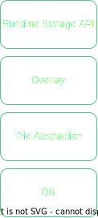

# FRAME Storage

---

## FRAME Storage

These are the four layers that we can find at Substrate's storage system:

- Runtime Storage (APIs) <- As a developer you interface with this
- Overlay
- Trie abstraction
- Key Value DB

---

### Overlay

<br/>
<div class="flex-container">
<div class="right-small" style="font-size:0.9em">

The overlay is the staging area

</div>

<div class="left">



</div>

---v

### Let's reproducea state mutation

---v

### Overlay

<br/>
<div class="flex-container">
<div class="right-small" style="font-size:0.9em">

- Runtime logic runs.
- Eventually a Runtime Storage API is called.
- The overlay is queried for the data.
- If not there, then the DB is queried for it.

</div>

<div class="left">


</div>

---v

### Overlay

<br/>
<div class="flex-container">
<div class="right-small" style="font-size:0.9em">

Now the information flows upwards
- DB data is returned all the way up to the runtime.
- Overlay caches that information.

</div>

<div class="left">


</div>

---v

### Overlay

<br/>
<div class="flex-container">
<div class="right-small" style="font-size:0.9em">

- The pallet will eventually write something to storage.
- Then the overlay is updated.
- Only at the end of the block the changes in the overlay will be commited to DB.
- After which a new storage root will be calculated. The final block state.

</div>

<div class="left">


</div>

Notes:

Reading the same storage a second or more times is faster, not free, than the initial read.
Writing the same value multiple times is fast, not free, and only results in a single db write.

---

### Transactional layers

- The runtime has the ability to spawn additional storage layers, called "transactional layers", on top of the overlay.
- This can allow you to commit changes through the Runtime Storage API, but then drop the changes if you want before they get to the overlay change set.
- Default behaviour for extrinsic execution. 

Does this sound familiar ?

Notes: 

This means that if you return an `Error` from your extrinsic, all changes to storage caused by that extrinsic are reverted.

---

## But how does this materialize in my pallet ?

FRAME Storage Primitives

- `StorageValue`
- `StorageMap`
- `CountedStorageMap`
- `StorageDoubleMap`
- `StorageNMap`

---v

## Storage value


```rust
pub struct StorageValue<Prefix, Value, QueryKind = OptionQuery, OnEmpty = GetDefault>(_);
```
Notes:

Place a single item into the runtime storage.

Storage Key:

```rust
Twox128(Prefix::pallet_prefix()) ++ Twox128(Prefix::STORAGE_PREFIX)
```

- At the Runtime Storage API level, a storage key will either have a value or not have a value.
- If there is no value, any query from the backend will be `None`.
- If there is a value, the query will be `Some(value)`.
- However, we can also hide this with a `Default` value.

---v

## `QueryKind`

```rust
pub struct StorageValue<Prefix, Value, QueryKind = OptionQuery, OnEmpty = GetDefault>(_);
```

- `OptionQuery`: Default choice, represents the actual DB state.
- `ValueQuery`: Return a value when `None`. (`Default` or configurable)

---

## `OnEmpty`

```rust
#[pallet::type_value]
pub fn MyDefault<T: Config>() -> u32 { 42u32 }

#[pallet::storage]
pub type Item<T> = StorageValue<_, u32, ValueQuery, MyDefault<T>>;
```

```rust
#[test]
fn my_default() {
	sp_io::TestExternalities::new_empty().execute_with(|| {
		// `42u32` is the configured `OnEmpty` value.
		assert_eq!(Item::<T>::get(), 42u32);
		Item::<T>::put(10u32);
		assert_eq!(Item::<T>::get(), 10u32);
	});
}
```

---

## Interesting operations

- `kill()`
- `take()`
- `mutate()`
- `try_mutate()`

Notes:

mutate and try_mutate expect a clousure, but try_mutate will only write if the clousure returns Ok()

## Bounded storage

Blockchains are constrained:

- Computation Time
- Memory Limits
- Storage Size / Proof Size

In general, every storage item in FRAME should be **bounded** in size.

---v

## Bounded vector

```rust
#[pallet::storage]
pub type Item<T> = StorageValue<_, BoundedVec<u8, ConstU32<100>>, ValueQuery>;
```

---

## Storage map

Key value map.

```rust
pub struct StorageMap<Prefix, Hasher, Key, Value, QueryKind = OptionQuery, OnEmpty = GetDefault, MaxValues = GetDefault>(_);
```

Storage Key:

```rust
Twox128(Prefix::pallet_prefix()) ++ Twox128(Prefix::STORAGE_PREFIX) ++ Hasher1(encode(key))
```

Notes:

The storage key for a map uses the hash of the key. You can choose the storage hasher, these are the ones currently implemented:

- Identity (no hash at all)
- Blake2_128
- Blake2_256
- Twox128
- Twox256
- Twox64Concat (special)
- Blake2_128Concat (special)

---

## Which Hasher to Use?

- `Identity` - No Hash at all
- `Twox64Concat` - Non-Cryptographic and Transparent
- `Blake2_128Concat` - Cryptographic and Transparent

Notes:

Basically, you should just always use `Blake2_128Concat` since it is hardest for a user to influence. The difference in time to execute is probably nominal (but not properly benchmarked afaik).

Some reasonable exceptions:

- If the key is already an uncontrollable cryptographic hash, you can use `Identity`.
- If the key is simple and controlled by runtime (like an incremented count), `Twox64Concat` is good enough.

---